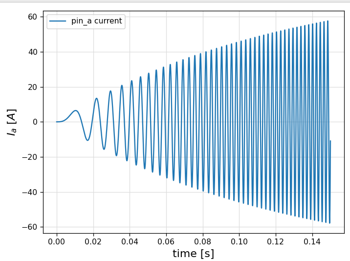
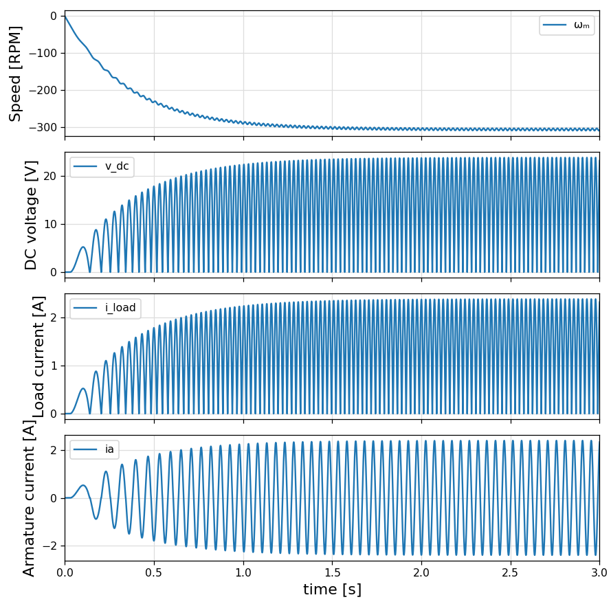

# Test cases for electrical circuits, using ModelingTookit (MTK)

## Installation

```bash
git clone https://github.com/ufechner7/MTKCircuits.git
cd MTKCircuits.jl
julia --project
```

and then in Julia:

```julia
using Pkg
Pkg.instantiate()
```

## 3 Phase Rectifier


To run the example:

```julia
include("examples/rectifier.jl)
```

**Result:**


**Remark:**
After calling `mtkcompile()` the system is a pure DAE system without any differential state.

## Synchronous Machine




To run the example:

```julia
include("examples/synchronous_machine.jl)
```

## Coupled System

This system combines the synchronous machine and the rectifier.

To run the example:

```julia
include("examples/coupled_system.jl)
```

The simulation finishes without error, but with one warning:

```text
┌ Warning: Did not converge after `maxiters = 100` substitutions. Either there \
│ is a cycle in the rules or `maxiters` needs to be higher.
└ @ Symbolics ~/.julia/packages/Symbolics/oZEAe/src/variable.jl:451
```

The result does not look correct, though.

## Simplified examples

I created two simplified examples with a synchronous machine and a rectifier:

```text
coupled_system_mwe.jl
mwe_flat.jl
```

Both work. The first one gives the "Did not converge..." warning, the second one not.
Both give very similar results when running the simulation.

## Two phase examples
I created two simplified examples with a synchronous machine and a rectifier:

```text
coupled_system_mwe2.jl
mwe_flat2.jl
```
Both work. The first one gives the "Did not converge..." warning, the second one not.
Both give very similar results when running the simulation.



