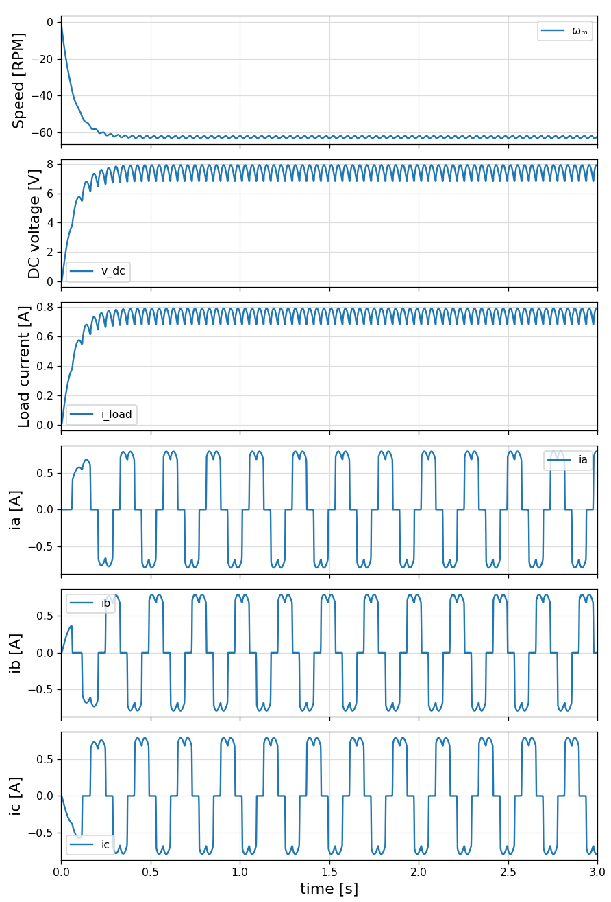

# Test cases for electrical circuits, using ModelingToolkit (MTK)

## Installation

```bash
git clone https://github.com/ufechner7/MTKCircuits.git
cd MTKCircuits.jl
julia --project
```

and then in Julia:

```julia
using Pkg
Pkg.instantiate()
```

## 3 Phase Rectifier


To run the example:

```julia
include("examples/rectifier.jl")
```

**Result:**


**Remark:**
After calling `mtkcompile()` the system is a pure DAE system without any differential state.

## Synchronous Machine


To run the example:

```julia
include("examples/synchronous_machine.jl")
```

## Coupled System

This system combines the synchronous machine and the rectifier.

To run the example:

```julia
include("examples/coupled_system.jl")
```

Using the RadauIIA5 solver, the example works if the DC voltage is below 137V.



## High voltage, coupled system

For higher DC voltages (here 928 V) it is necessary to add a small (here 650 pF) capacitor in parallel to the diodes, and also a very small resistor (here 1 mOhm) in series.

Example:
```julia
include("examples/coupled_system2.jl")
```

The following solver parameters where used:
```julia
sol = solve(prob, RadauIIA5(κ = 0.005), abstol = 1e-7, reltol = 1e-8, saveat = 0.000025, maxiters = 5e6)
```

## Simplified examples

I created two simplified examples with a synchronous machine and a rectifier:

```text
coupled_system_mwe.jl
mwe_flat.jl
```

Both work. The first one gives the "Did not converge..." warning, the second one not.
Both give very similar results when running the simulation.

## Two phase examples

I created two simplified examples with a synchronous machine and an H-bridge rectifier:

```text
coupled_system_mwe2.jl
mwe_flat2.jl
```

Both work. The first one gives the "Did not converge..." warning, the second one not.
Both give very similar results when running the simulation.


