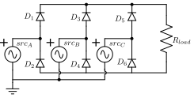
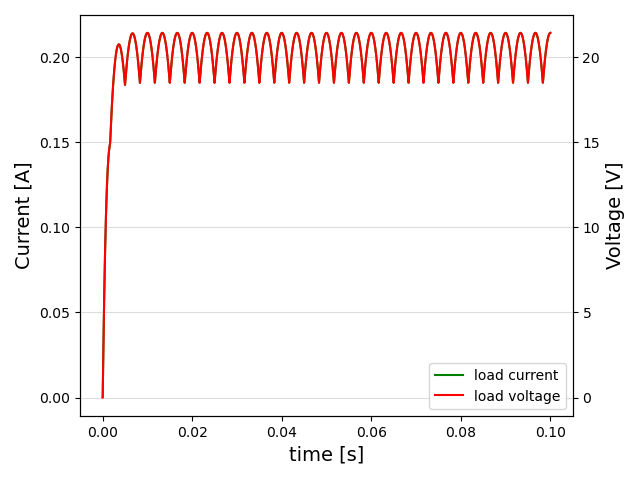
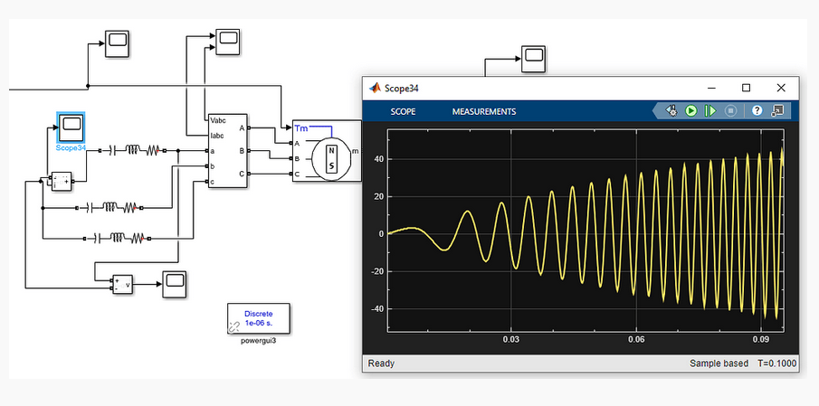

# Test cases for electrical circuits, using ModelingTookit (MTK)

## Installation

```bash
git clone https://github.com/ufechner7/MTKCircuits.git
cd MTKCircuits.jl
julia --project
```

and then in Julia:

```julia
using Pkg
Pkg.instantiate()
```

## 3 Phase Rectifier



To run the example:

```julia
include("examples/rectifier.jl)
```

**Result:**



**Remark:**
After calling `mtkcompile()` the system is a pure DAE system without any differential state.

## Synchronous Machine



To run the example:

```julia
include("examples/synchronous_machine.jl)
```